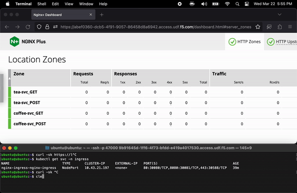

# Per URI and Per Method Metrics for the NGINX Plus Ingress Controller

This repo provides instructions (and a helm example) for automatic insertion of `status_zone` directives into every location block configured by an Ingress or another resource (like the VirtualServer CRD) for use with NGINX Plus. This allows for API monitoring of HTTP requests broken out on a per method basis by hitting the NGINX Plus API at `{nginxHost}/api/{apiVersion}/http/location_zones/{httpLocationZoneName}`, with separate endpoints to monitor GET, POST, and other methods that the user defines.

## Demo:


## Note:
This assumes you have already deployed the NGINX Plus Ingress Controller following the steps documented here (either via helm or via manifests): https://docs.nginx.com/nginx-ingress-controller/installation/

## Instructions

If you want to use NGINX+ Ingress Controller to dynamically insert status_zone directives for API monitoring at every location block within a particular type of resource in a way that differentiates between HTTP methods, Here's what to do: 

1. Go to the root of the project directory where you cloned the kubernetes-ingress repository. 
2. Copy any of your custom config (e.g. your helm `values.yml`) and any other user configuration to another directory outside of the project root. 
3. Checkout the branch of the repository that corresponds to the NGINX Ingress Controller release you are using. E.g. I'm on `v3.0.2`, so I ran 
```shell
cd kubernetes-ingress
git checkout v3.0.2
```
4. From there, go to `$PROJECT_ROOT/internal/configs`. The templates for global config and for Ingress resources are in the `version1` subfolder and the templates for CRDs are in the `version2` subfolder.
5. Determine which resource you want to apply per-URI and per-method metrics to and open up the file corresponding file with extension `.tmpl` For example, `$PROJECT_ROOT/internal/configs/version1/nginx-plus.ingress.tmpl` is the template file for the Ingress resource on NGINX Plus, and `$PROJECT_ROOT/internal/configs/version2/nginx-plus.virtualserver.tmpl` is the template file for the VirtualServer CRD resource on NGINX Plus.
6. Copy the contents of that file into one of two places, and make sure it's at the next level of indentation to the parent element, depending on if you deployed via helm or via manifests. 
    * **If via helm:** 
    
      The .tmpl file must be inserted at `controller.config.entries.[TEMPLATE_NAME]`. 
      
      For example, If you are modifying the Ingress template it would be at `controller.config.entries.ingress-template`
    * **If via manifests:** 
    
      The .tmpl file must be inserted at `data.[TEMPLATE_NAME]`. 
      
      For example with Ingress it would be `data.ingress-template`
7. If you have trouble figuring out where to insert the contents, see my [full example for helm](custom-values.yml), and see [this one](https://github.com/nginxinc/kubernetes-ingress/tree/main/examples/shared-examples/custom-templates) for a basic example using the ConfigMap manifest.
8. Locate the portion of the template responsible for location block creation. On the Ingress template, you are looking for these specific lines:
```tmpl
{{range $location := $server.Locations}}
location {{$location.Path}} {
```
9. Insert the following below those lines:  
```tmpl 
if ($request_method = GET) {
  status_zone {{$location.ServiceName}}_GET;  
}
if ($request_method = POST) {
  status_zone {{$location.ServiceName}}_POST;  
}
```
10. Repeat for any other HTTP methods you want API metrics for.
11. Upgrade your helm release or apply the ConfigMap manifest, depending on your deployment method.
>Note: This will look slightly different for other resources besides Ingress. For example if you are using VirtualServer, you will need to instead locate these lines in the `.tmpl`:
```tmpl
{{ range $l := $s.Locations }}
location {{ $l.Path }} {
```
>And the lines you insert afterwards will need to use $l instead of $location, but everything else should be the same. 
